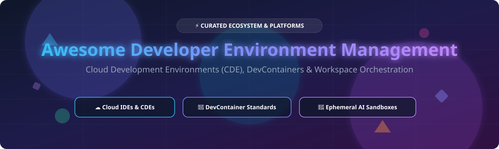

  

# 🚀 Awesome Developer Environment Management

  
  
  
  
  
  

---

## 💡 Overview & Market Insights

> 📊 **Estimated Market Size & Structure**: The global **Cloud Development Environment (CDE) and Developer Environment Management** market is estimated at **~$4.5 Billion** and is projected to reach **$12.8 Billion by 2030** (CAGR ~16.5%). The market is **moderately fragmented**, experiencing a strategic shift where traditional CDE platforms compete alongside Nix-powered reproducible environments and ultra-low latency AI agent execution sandboxes.

Welcome to the ultimate curated directory of **Developer Environment Management** solutions! 🛠️ This resource tracks top **SaaS products** and high-impact **Open-Source GitHub projects** focused on reproducible development environments, cloud IDEs, DevContainer specifications, and AI agent execution sandboxes.

---

## 📑 Table of Contents

- [☁️ SaaS / Hosted Platforms](#-saas--hosted-platforms)
- [🔓 Open-Source GitHub Projects](#-open-source-github-projects)
- [🤝 How to Contribute](#-how-to-contribute)
- [💖 Support & Sponsorship](#-support--sponsorship)
- [📈 Star History](#-star-history)
- [⚠️ Disclaimer](#%EF%B8%8F-disclaimer)

---

## ☁️ SaaS / Hosted Platforms

Below is a curated overview of hosted enterprise SaaS platforms for developer environment orchestration, sorted by company revenue / scale (descending) 📉.

| 🏢 Platform | 💰 Starting Price | 🎁 Free Tier / Trial Limit | 📊 Company Scale (Revenue / Funding) | 📝 Description |
| :--- | :--- | :--- | :--- | :--- |
| **[JetBrains CodeCanvas](https://www.jetbrains.com/codecanvas/)** 🛠️ | $15.00/user/month | 30-Day Free Trial (Core platform free tier sunsetting) | **~$350M Annual Revenue** (~$6B Valuation) | Managed CDE platform with native JetBrains IDE integration (IntelliJ IDEA, PyCharm, WebStorm). |
| **[Gitpod (Ona / Flex)](https://www.gitpod.io/)** ⚡ | $9.00/month | 500 Credits / mo (~50 hrs free) | **$41M Total Funding** (Series A led by GitHub founder) | Cloud development environment platform pivoted to AI agent infrastructure and self-hosted runners. |
| **[DevZero](https://www.devzero.io/)** 🚀 | $5.00/CPU/month | Free forever tier for K8s monitoring & 14-day full trial | **$26M Total Funding** (Series A led by Anthos & Foundation Cap) | Standardized, reproducible dev environments with cloud infrastructure & K8s optimization. |
| **[Strong Network](https://www.strong.network/)** 🛡️ | Custom Enterprise Quotes | Custom Demo / Enterprise Pilot via Citrix | **Acquired by Citrix** (Integrated as Citrix SecurSpaces) | Enterprise CDE platform focused on security, compliance, and zero-trust source code isolation. |

---

## 🔓 Open-Source GitHub Projects

Top open-source projects for Developer Environment Management, ranked by **GitHub Star Count (descending)** ⭐.

| 📦 Project & Repo Link | ⭐ Star Count Badge | 📜 License | 🎯 Category & Description |
| :--- | :--- | :--- | :--- |
| **[code-server](https://github.com/coder/code-server)** 🖥️ |  | MIT | **Web IDE**: Runs VS Code in any browser on a remote server or container. |
| **[Daytona](https://github.com/daytonaio/daytona)** ⚡ |  | AGPL-3.0 | **AI Agent Sandbox**: Secure, elastic sub-90ms sandbox creation for code execution. |
| **[Coder](https://github.com/coder/coder)** 🏗️ |  | AGPL-3.0 | **Self-Hosted CDE**: Enterprise Terraform-based developer environment platform. |
| **[Dagger](https://github.com/dagger/dagger)** 🗡️ |  | Apache-2.0 | **Composable Engine**: Programmable CI/CD & container workflow engine for AI agents. |
| **[DevPod](https://github.com/loft-sh/devpod)** 📦 |  | Apache-2.0 | **Client-Only CDE**: DevContainer-based lightweight tool with no server required. |
| **[Gitpod Classic / Core](https://github.com/gitpod-io/gitpod)** ☁️ |  | AGPL-3.0 | **Open CDE Platform**: The original open-source CDE platform for automated environments. |
| **[Eclipse Che](https://github.com/eclipse-che/che)** 🏛️ |  | EPL-2.0 | **K8s-Native CDE**: Kubernetes-based enterprise workspace platform by Red Hat. |
| **[OpenVSCode Server](https://github.com/gitpod-io/openvscode-server)** 🌐 |  | MIT | **Lightweight Browser IDE**: Minimalist upstream VS Code web runtime by Gitpod. |
| **[Flox](https://github.com/flox/flox)** ❄️ |  | GPL-2.0 | **Nix Reproducibility**: Declarative, cross-platform environments powered by Nix. |
| **[DevContainers CLI](https://github.com/devcontainers/cli)** 🐳 |  | MIT | **Specification Reference**: Reference CLI spec for building and running DevContainers. |

---

## 🤝 How to Contribute

Contributions are warmly welcomed! 🌟 Follow these simple steps to add or update solutions:

1. 🍴 **Fork** this repository.
2. ✍️ Edit `README.md` following the exact table structure.
3. 🔎 Ensure pricing details, free tier limits, and GitHub links are accurate.
4. 🚀 Submit a **Pull Request** with a descriptive summary of your changes.

---

## 💖 Support & Sponsorship

If you found this curated list helpful, please consider supporting the project! Your encouragement keeps the repository updated and well-maintained. ✨

- ⭐ **Star this repository** to spread visibility!
- 🔀 **Fork & Share** with your colleagues and platform teams!
- ☕ **Buy Me a Coffee / Sponsor**: Support ongoing maintenance via [GitHub Sponsors Dashboard](https://github.com/sponsors/ishandutta2007).

  

---

## 📈 Star History

---

## ⚠️ Disclaimer

- This list is **community-curated** for research and educational purposes.
- Always review security, compliance, and enterprise data policies before adopting CDE infrastructure.
